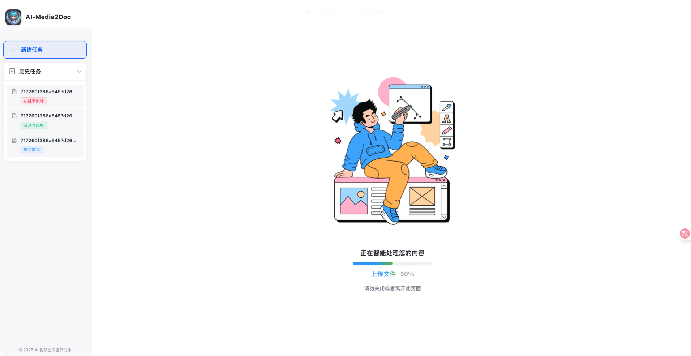
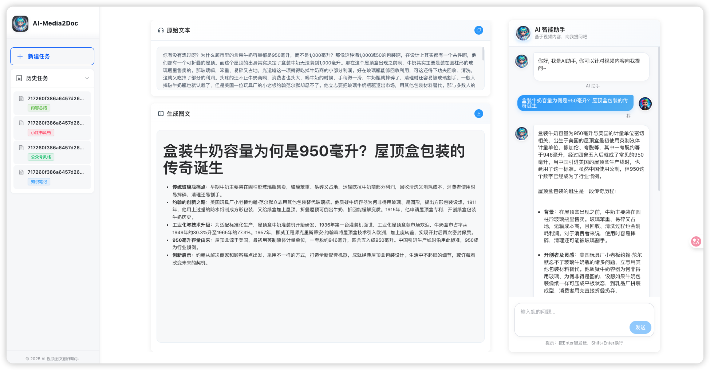
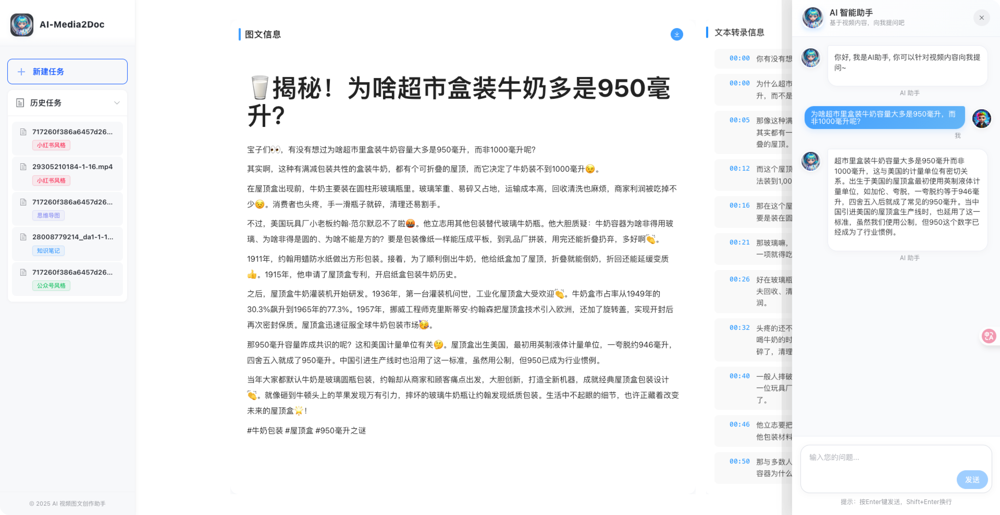

<h1 align="center">
  <p>
  
    </p>
</h1>

<p align="center">
    <a href="https://hellogithub.com/repository/d869461d98d245d388b50e25b6a80dae" target="_blank"></a>
</p>

<p align="center">
  <a href="./LICENSE"></a>
  
  
</p>


### 📖 简介

AI 视频图文创作助手是一款 Web 工具, 基于 AI 大模型, 一键将视频和音频转化为各种风格的文档, 无需登录注册, 前后端本地部署，以极低的成本体验 AI 视频/音频转风格文档服务。

### ✨ 核心功能

- ✅ **完全开源**：MIT 协议授权，支持本地部署。
- 🔒 **隐私保护**：无需登录注册，任务记录保存在本地
- 💻 **前端处理**：采用 ffmpeg wasm 技术，无需本地安装 ffmpeg
- 🎯 **多种风格支持**：支持小红书/公众号/知识笔记/思维导图/内容总结等多种文档风格支持。
- 🤖 **AI 对话**：支持针对视频内容进行 AI 二次问答。
- 🎬 **支持字幕导出**: 结果一键导出为字幕文件。
- 🎨 **支持自定义 Prompt**：支持在前端自定义配置 prompt。
- 🐳 **一键部署**：支持 Docker 一键部署。


### 🔜 未来计划

- 📷 支持智能截取视频关键帧，实现真正的图文并茂
- 🎙️ 音频识别支持使用 fast-whisper 本地大模型处理，进一步降低成本
- 🎨 支持在前端自定义配置 prompt。


### 项目截图

#### 全新设计的首页, 尽力之作

<p align="center">
    
</p>

#### 更加简洁的加载页
<p align="center">

</p>


#### 全新设计的结果页, 支持一键导出为字幕。
<p align="center">

</p>

#### 支持自定义 prompt
<p align="center">

</p>


#### 可基于视频内容进行 AI 二次对话

<p align="center">

</p>


### 📦 docker 本地一键部署
0️⃣: 安装 `docker`, 这个网上有教程

1️⃣：镜像构建, 在项目根目录下执行:
```shell
$ make docker-image
```
2️⃣：请根据 [后端部署指引 / 配置项说明](https://github.com/hanshuaikang/AI-Media2Doc/blob/main/backend/README.md#%E5%9C%A8%E7%81%AB%E5%B1%B1%E5%BC%95%E6%93%8E%E8%8E%B7%E5%8F%96%E5%AF%B9%E5%BA%94%E7%9A%84%E7%8E%AF%E5%A2%83%E5%8F%98%E9%87%8F%E7%9A%84%E5%80%BC) 完善根目录下的 `variables.env` 文件。 

3️⃣：运行项目,在项目根目录下执行:

```shell
$ make run
```

### 👾 开发者的废话

AI 视频创作助手源于我年初的一个想法, 作为一个喜欢阅读的人, 我更希望将一些视频内容转化为文字, 方便我进行二次阅读思考和总结记录笔记, 但市面上并没有一个好的工具来实现这个想法, 大多数工具都需要登录和付费, 我不太想在互联网上注册过多的账号, 同时也不想将自己想要总结的内容上传至除了云厂商之外的第三方平台，因此我开发了这个小应用，MIT 协议, 任何人都可以以极低的成本去体验音视频转文本。


### 🔄 处理流程

<p align="center">

</p>

### 🔧 本地开发指南

- [后端本地部署](./backend/README.md)
- [前端本地部署](./frontend/README.md)

### 📄 许可证

本项目采用 [MIT 许可证](./LICENSE)

### 🔗 相关链接

- [volcengine-ai-app-lab](https://github.com/volcengine/ai-app-lab)

- [throttled-py](https://github.com/ZhuoZhuoCrayon/throttled-py)：✨Python 限流库，合理限制、平滑云资源用量。

### 🌵 支持开发者
你可以关注我的小红书:

[韩数的开发笔记： 致力于分享 Github 上那些好玩、有趣、免费、实用的高质量项目](https://www.xiaohongshu.com/user/profile/5e2992b000000000010064a4)

**或者请我吃一包辣条** , 作为一个超级喜欢吃辣条的人, 很多晚上维护开源项目都是边吃辣条边写代码的 🤪。如果你有很喜欢吃的辣条, 你可以投喂我吃一包辣条, 5毛一包的也可以, 我将直接开启代码狂暴模式(化身八爪鱼: 🐙)。

请留下你要赞助作者的辣条名称 (🤩❤️‍🔥): 支持卫龙/麻辣王子/博士牛筋/臭干子，禁止投喂(🥵😵😵‍💫🤧🥴): **缺牙齿**/**霸王丝**等有损本人生命值的辣条。

同时请备注你的 github 名称, 方便我整理展示在项目主页。🙌

<p align="left">
 赞助作者: <a href="https://afdian.com/a/hanshu-github">我的爱发电主页</a>
</p>


### 🙌 致谢
感谢这些朋友对本项目做出的贡献:

|  |  |
|:-:|:-:|
| <a href="https://github.com/ZhuoZhuoCrayon"><br/>crayon</a> | <a href="https://github.com/cjx929"><br/>chen_jx</a> |

感谢以下自媒体对本项目的关注和转发(以下排名不分先后), 大家感兴趣的话可以关注下他们 ～

| [HelloGithub](https://hellogithub.com)   |                           开源AI项目落地                            |                               [阮一峰的网络日志](https://www.ruanyifeng.com/blog/weekly/)                               |                               一飞开源                               |
|:----:|:-------------------------------------------------------------:|:---------------------------------------------------------------------------------------------------------------:|:------------------------------------------------------------:|
|| | |  |

小红书:
[小红书：AI-GitHub](https://www.xiaohongshu.com/user/profile/65c44d1200000000090254fc)

推特:
| [Geek](https://x.com/geekbb) | [AIGCLINK](https://x.com/aigclink) | [ilovelife](https://x.com/ilovek8s) | [ahhhhfs](https://x.com/abskoop)

### 🌟 Star History

[](https://www.star-history.com/#hanshuaikang/AI-Media2Doc&Date)

