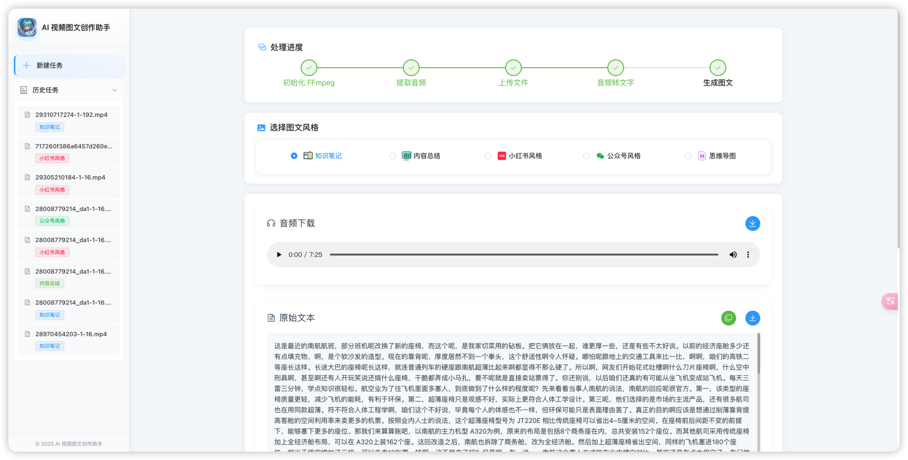
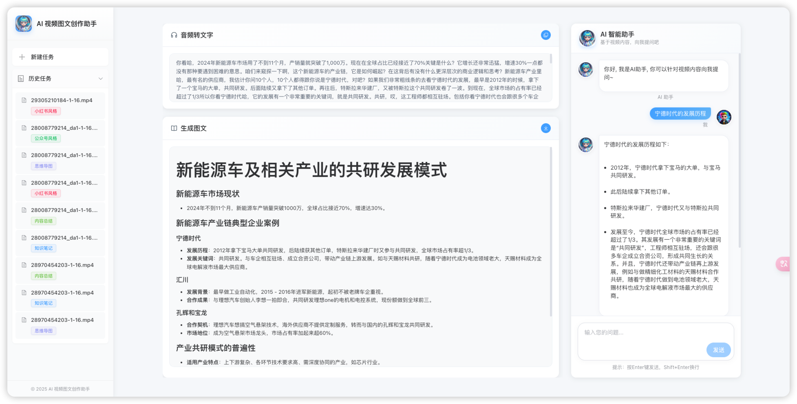
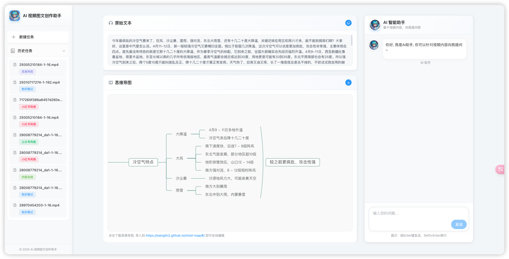
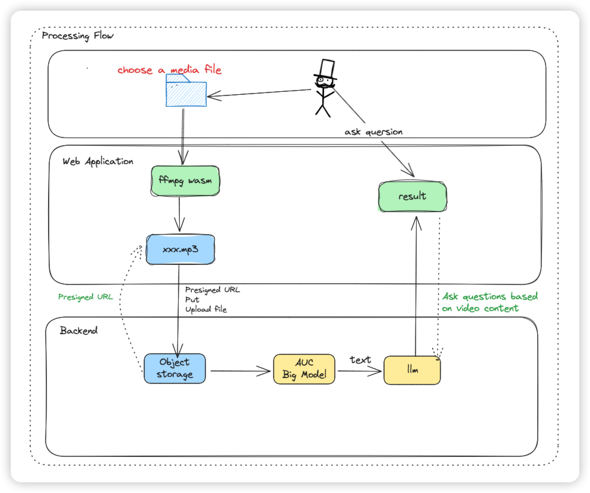

<h1 align="center">
  

  
 

  AI 视频图文创作助手
</h1>

    <em>基于AI大模型, 一键将视频和音频转化为小红书/公众号/知识笔记/思维导图等各种风格的文档。</em>

  
  

    

[English Document](./README_EN.md)

### 📖 简介

AI 视频图文创作助手是一款Web工具, 基于AI大模型, 一键将视频和音频转化为各种风格的文档, 无需登录注册, 前后端本地部署，以极低的成本体验 AI 视频/音频转风格文档服务, 五块钱我开发测试了一月刚好用完。

### ✨ 核心功能

- ✅ **完全开源**：MIT 协议授权，支持本地部署。
- 🔒 **隐私保护**：无需登录注册，任务记录保存在本地
- 💻 **前端处理**：采用 ffmpeg wasm 技术，无需本地安装 ffmpeg
- 🎯 **多种风格支持**：支持小红书/公众号/知识笔记/思维导图/内容总结等多种文档风格支持。
- 🤖 **AI 对话**：支持针对视频内容进行 AI 二次问答。
- 🤖 **本地部署友好**：有点开发基础卡卡3下俩除2就跑起来了。

### 🔜 未来计划

- 📷 支持智能截取视频关键帧，实现真正的图文并茂
- 🎙️ 音频识别支持使用 fast-whisper 本地大模型处理，进一步降低成本
- 🎨 使用 React 完全重构前端页面，带来更加流畅丝滑的体验。
- 🐳 支持 Docker 一键部署

### 👾 开发者的废话

AI 视频创作助手源于我年初的一个想法, 作为一个喜欢阅读的人, 我更希望将一些视频内容转化为文字, 方便我进行二次阅读思考和总结记录笔记, 但市面上并没有一个好的工具来实现这个想法, 大多数工具都需要登录和付费, 我不太想在互联网上注册过多的账号, 同时也不想将自己想要总结的内容上传至除了云厂商之外的第三方平台，因此我开发了这个小应用，MIT 协议, 任何人都可以以极低的成本去体验音视频转文本。

### 项目截图

#### 支持针对视频内容进行 AI 二次问答。

#### 支持生成思维导图

生成的思维导图可导出至第三方平台进行编辑优化

### 🔄 处理流程

### 📦 安装指南

- [后端本地部署](./backend/README.md)
- [前端本地部署](./frontend/README.md)

### 📄 许可证

本项目采用 [MIT 许可证](./LICENSE)

### 🔗 相关链接

- [volcengine-ai-app-lab](https://github.com/volcengine/ai-app-lab)

### 🌵 支持开发者
本项目暂时还未考虑开启捐赠渠道，不过我个人业余时间维护了一个小红书, 大家感兴趣的话可以点个关注，就当支持开发者啦。

[韩数的开发笔记： 致力于分享 Github 上那些好玩、有趣、免费、实用的高质量项目](https://www.xiaohongshu.com/user/profile/5e2992b000000000010064a4)

### 🌟 Star History

